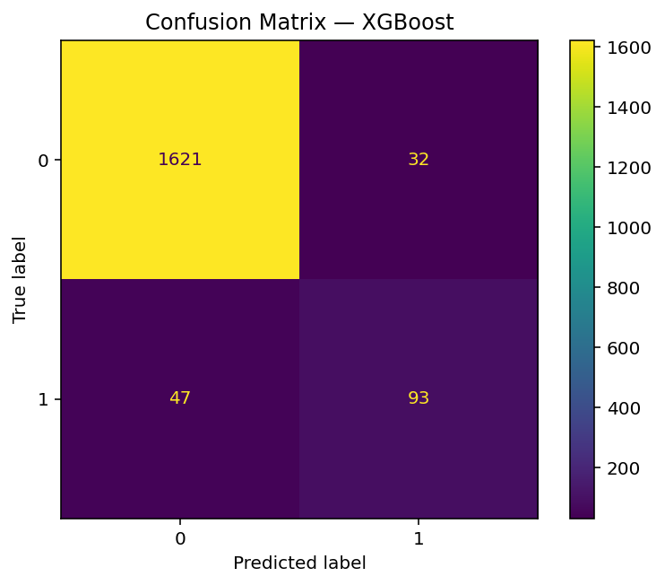
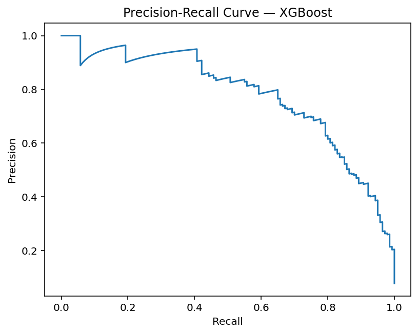
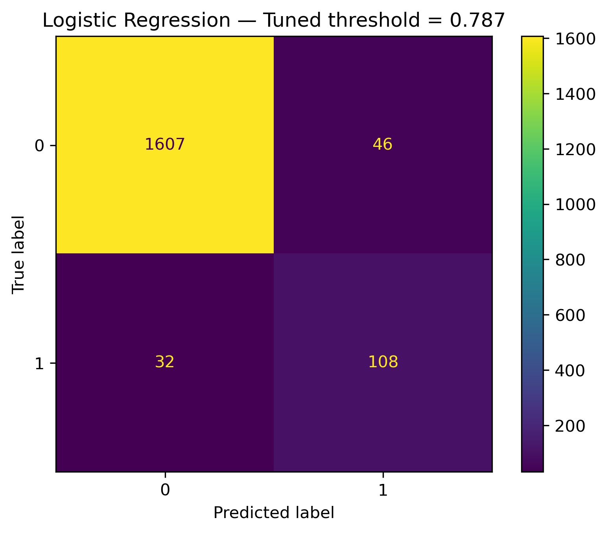
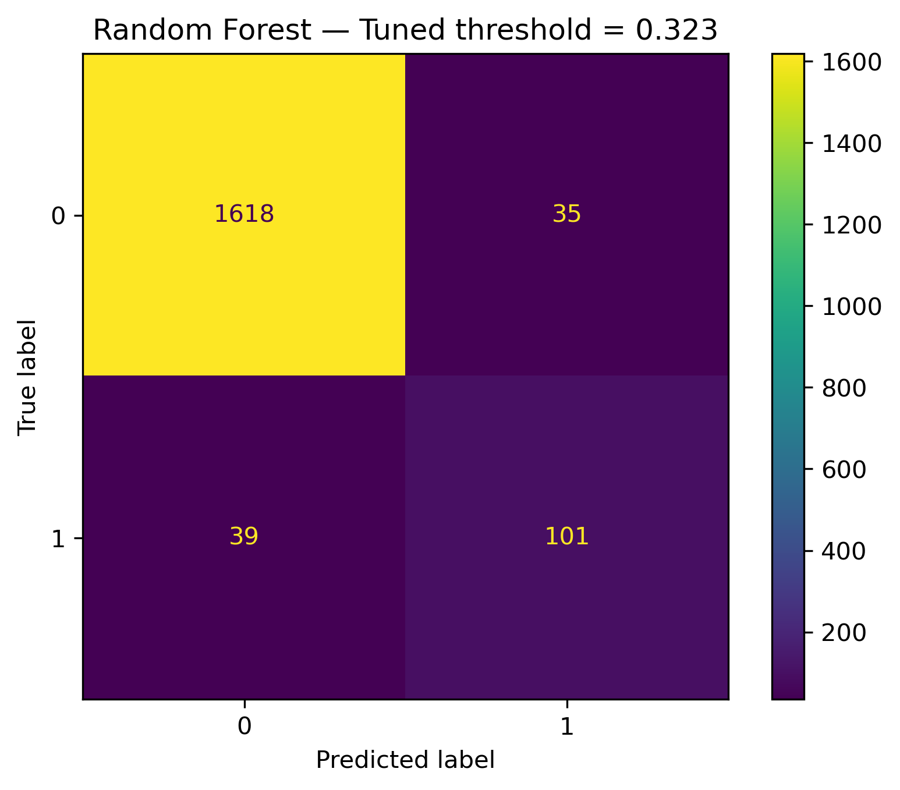

# Predicting Elevated Liver Enzyme Levels from Alcohol Use and Demographics  
**CS 4641 – Machine Learning | Final Report**

---

## Introduction / Background

Alanine Aminotransferase (ALT) is a widely used biomarker of liver function. Elevated ALT levels can indicate alcohol-associated liver stress, metabolic conditions, medication effects, or other forms of hepatic injury. Because mild–moderate liver stress is often asymptomatic, predictive tools can support earlier risk identification and follow-up testing.

This project uses NHANES 2017–March 2020 Pre-Pandemic data, a nationally representative dataset collected by the CDC. NHANES includes demographics, laboratory tests, and detailed alcohol consumption information. Our goal is to assess how well these factors predict elevated ALT values.

We focus on a **risk-stratification** framing, not a medical diagnosis. Our target is whether ALT > 40 IU/L, a common clinical threshold for “elevated.”

---

## Problem Definition

**Goal:**  
Use demographic, laboratory, and alcohol-use features to predict whether an individual's ALT value is elevated (> 40 IU/L).

**Data sources used:**  
- `P_DEMO.XPT` — Demographics (age, sex, ethnicity, marital status, education, etc.)  
- `P_ALQ.XPT` — Alcohol use questionnaire  
- `P_BIOPRO.XPT` — Biochemistry labs (including the ALT measurement used to derive the label)

Files were merged on `SEQN`, cleaned, and reduced to ~30 relevant columns and ~8,900 rows.

**Target variable:**  
elevated_alt = 1 if LBXSATSI (ALT) > 40, else 0

ALT itself and SEQN were removed from features.

This is a **supervised binary classification** problem trained using an 80/20 stratified train-test split to preserve the roughly 7.8% positive class rate.

---

## Methods

### Data Preprocessing

Preprocessing was implemented using scikit-learn Pipelines to avoid leakage and ensure reproducibility.

**Steps:**

1. **Missing values**
   - Numeric: median imputation  
   - Categorical: most-frequent imputation  
   (`SimpleImputer`)

2. **Categorical encoding**
   - One-hot encoding via `OneHotEncoder(handle_unknown="ignore")`

3. **Feature scaling**
   - Standardization of numeric features (`StandardScaler`)

4. **ColumnTransformer**
   - Combined numeric + categorical pipelines into one unified preprocessing block

5. **Pipeline**
   - Preprocessing and model combined for consistent behavior across training/testing

---

## Models Implemented

We implemented and compared three supervised models:

### 1. Logistic Regression (baseline)
- `LogisticRegression(max_iter=1000, class_weight="balanced")`
- Interpretable linear baseline  
- Good for probability outputs and threshold tuning  
- Benefits from clean, well-scaled features

### 2. Random Forest Classifier
- `RandomForestClassifier(n_estimators=300, random_state=42)`
- Nonlinear ensemble model  
- Naturally handles interactions  
- Tends to be conservative → few false positives

### 3. XGBoost Classifier
- `XGBClassifier(n_estimators=300, max_depth=4, learning_rate=0.1, subsample=0.9)`
- Gradient-boosted trees  
- Strong performance on tabular data  
- Captures complex relationships  
- Best overall balance of recall and precision

---

## Results and Discussion

Models are evaluated on:
- Accuracy  
- F1 Score  
- AUROC  
- Confusion Matrices  
- Precision–Recall curves  
- Threshold tuning (to maximize F1)

---

# Default Threshold Results (Threshold = 0.5)

---

## Logistic Regression — Default Threshold

**Metrics:**
- Accuracy: ~0.91  
- F1: 0.596  
- AUROC: 0.963  

**Confusion Matrix (default):**  

**ROC Curve:**  

**PR Curve:**  

**Interpretation:**  
- Very high recall (few false negatives), which is desirable.  
- But many false positives (150), meaning the model over-flags risk.  
- Strong AUROC → good separability.

---

## Random Forest — Default Threshold

**Metrics:**
- Accuracy: ~0.95  
- F1: ~0.55  
- AUROC: ~0.968  

**Confusion Matrix (default):**  

**ROC Curve:**  

**PR Curve:**  

**Interpretation:**  
- RF is highly conservative → only **7 false positives**.  
- But misses many true elevated ALT cases → **75 false negatives**.  
- Precision is extremely high; recall is low.

---

## XGBoost — Default Threshold

**Metrics:**
- Accuracy: ~0.94  
- F1: ~0.69  
- AUROC: ~0.969  

**Confusion Matrix (default):**  

**ROC Curve:**  

**PR Curve:**  

**Interpretation:**  
- Best F1 among default models.  
- Balanced error profile: fewer misses than RF and fewer false alarms than LR.  
- High AUROC confirms strong ranking ability.

---

# Tuned Threshold Results (Optimizing F1)

Thresholds were optimized using `precision_recall_curve` to maximize the F1 score for each model.

---

## Logistic Regression — Tuned Threshold = 0.787

**Tuned Metrics:**
- F1: 0.735  
- Precision: 0.701  
- Recall: 0.771  

**Confusion Matrix (tuned):**  

**Interpretation:**  
- False positives drop dramatically (150 → 46).  
- Recall stays strong.  
- LR becomes much more balanced than at default threshold.

---

## Random Forest — Tuned Threshold = 0.323

**Tuned Metrics:**
- F1: 0.732  
- Precision: 0.743  
- Recall: 0.721  

**Confusion Matrix (tuned):**  

**Interpretation:**  
- Recall improves massively (75 FN → 39 FN).  
- Still maintains reasonably low false positives (26).  
- More balanced than the default conservative setting.

---

## XGBoost — Tuned Threshold = 0.257

**Tuned Metrics:**
- F1: 0.732  
- Precision: 0.690  
- Recall: 0.779  

**Confusion Matrix (tuned):**  

**Interpretation:**  
- Best recall of any model → catches the most elevated ALT cases.  
- False positives remain acceptable for a screening tool.  
- Clinically, this is the strongest tuned model.

---

# Comparison of Tuned Models

| Model | Best Threshold | Tuned F1 | Precision | Recall |
|-------|----------------|----------|-----------|--------|
| Logistic Regression | 0.787 | 0.735 | 0.701 | 0.771 |
| Random Forest | 0.323 | 0.732 | 0.743 | 0.721 |
| XGBoost | 0.257 | 0.732 | 0.690 | 0.779 |

**Summary:**
- **XGBoost** → best recall (most medically important).  
- **Random Forest** → best precision (fewest false alarms).  
- **Logistic Regression** → interpretable and competitive after tuning.

---

# Medical Interpretation: False Positives vs False Negatives

**False Negatives (missed elevated ALT)**  
More clinically dangerous. A missed elevation may delay detection of liver injury or metabolic disease.

**False Positives (flagging normal as elevated)**  
Less dangerous but cause unnecessary follow-up testing and anxiety.

**Therefore:**  
In medical screening, **recall is more important** than precision.  
This favors **XGBoost**, which achieves the highest recall after tuning.

---

## Why These Models Behaved Differently

- Logistic Regression assumes linearity → simple, interpretable, but limited.  
- Random Forest is conservative → avoids FP but allows many FN.  
- XGBoost adjusts to difficult cases using boosting → best balance between recall and precision.

All models achieved AUROC between 0.96–0.97, indicating strong signal in the features.

---

# Next Steps

### 1. Proper hyperparameter tuning  
Grid search or randomized search for RF and XGBoost would further improve performance.

### 2. SHAP interpretability  
Tree-based models can be explained to identify the most influential features.

### 3. Fairness analysis  
Evaluate AUROC and F1 across sex and race to assess model equity.

### 4. Calibration  
Check whether predicted probabilities reflect true clinical risk.

### 5. Add confounders  
BMI, comorbidity indicators, and hepatitis markers would strengthen predictive power.

### 6. External validation  
Train on 2017–2018, test on 2019–2020 to mimic real-world generalization.

### 7. **Regression Extension (New)**  
Instead of only predicting **elevated vs. normal**, we could treat ALT as a **continuous variable** and predict its actual value.  
This would allow:

- Estimating degree of liver stress  
- More nuanced clinical decision support  
- Use of regression models such as:
  - RandomForestRegressor  
  - XGBoostRegressor  
  - Linear/Elastic Net Regression  

This extension could deepen clinical utility and broaden the ML scope beyond classification.

---

## References

1. Centers for Disease Control and Prevention (CDC). NHANES 2017–March 2020 Pre-Pandemic Data.  
2. Scikit-learn Documentation: https://scikit-learn.org/  
3. XGBoost Documentation: https://xgboost.readthedocs.io/  

---

## Contribution Table (Final)

| Name | Final Contributions |
|------|---------------------|
| Rishan | Model implementation, preprocessing code, tuned thresholds, XGBoost + RF analysis, visualizations, and full final write-up. |
| Sai | Assisted with dataset structure, validation of splits, tuning logic, and interpretation. |
| Ashfiq | Computed evaluation metrics, confusion matrix evaluation, helped interpret ROC and PR curves. |
| Rishi | GitHub Pages formatting, polishing final report layout and presentation preparation. |
| Avaneesh | Supported preprocessing improvements, missing-value validation, and feature checks. |

---

**Gantt Chart:**  
https://docs.google.com/spreadsheets/d/1DGG8UT4Gw_CVyhd8yabUYZYYpycG1OVeVBzA1P4FZMg/edit?usp=sharing

