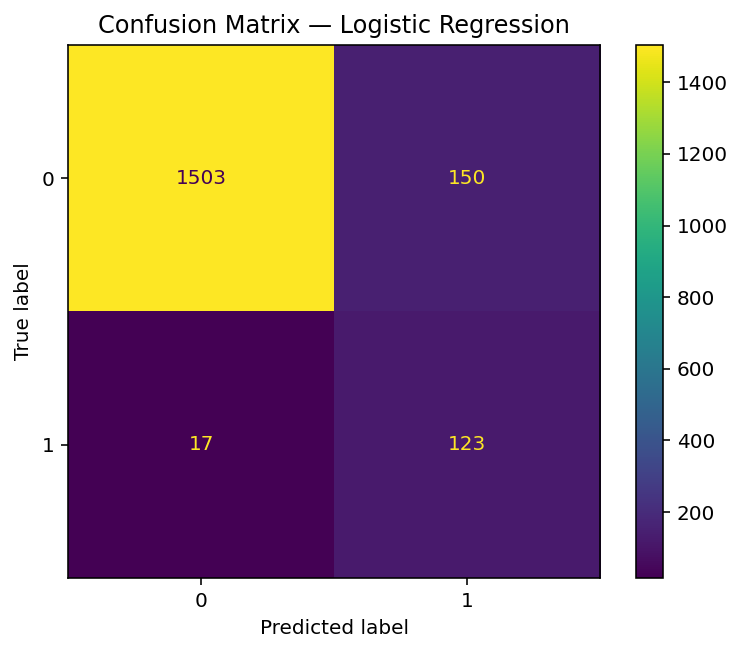
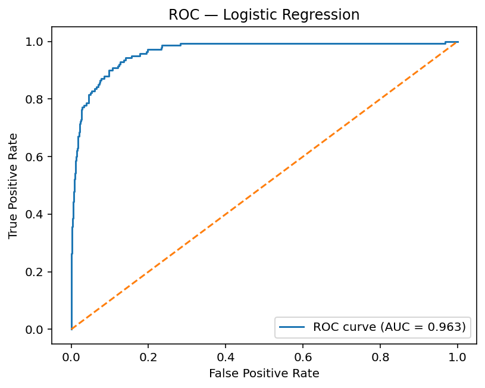
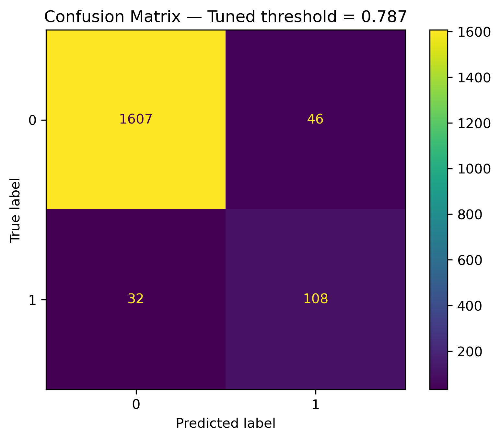

# Predicting Elevated Liver Enzyme Levels from Alcohol Use and Demographics  
**CS 4641 – Machine Learning | Midterm Report**

---

## Introduction / Background

Liver enzymes such as ALT, AST, and GGT are biochemical indicators of liver function. Elevated levels of these enzymes can signal potential liver stress or damage, often associated with alcohol consumption, obesity, or other health factors. Early prediction of elevated enzyme levels can help identify at-risk individuals before more severe liver disease develops.

This project uses data from the NHANES 2017–March 2020 Pre-Pandemic survey, which includes nationally representative health and lifestyle data collected by the CDC. We focus on the relationship between alcohol use patterns and liver enzyme elevation, framed as a risk stratification task rather than a medical diagnosis.

Our objective is to build a supervised machine learning model that predicts whether an individual’s ALT (Alanine Aminotransferase) level is elevated (> 40 IU/L) based on their demographics, alcohol use, and biochemistry features.

---

## Problem Definition

**Goal:**  
Predict if a participant has an elevated ALT level (binary classification: 1 = ALT > 40 IU/L, 0 = normal).

**Dataset:**  
NHANES 2017–March 2020 (Pre-Pandemic) public microdata files:  
- `P_DEMO.XPT` – Demographics (age, sex, race, income, education, marital status)  
- `P_ALQ.XPT` – Alcohol use questionnaire  
- `P_BIOPRO.XPT` – Biochemistry profile (liver enzyme levels and related biomarkers)

These were merged using the participant ID `SEQN` into one file (`nhanes_merged.csv`), then cleaned and reduced to relevant features, resulting in approximately 8,900 rows and 30 columns.

**Target variable:**  
`elevated_alt = 1 if LBXSATSI (ALT) > 40, else 0`

This framing is a supervised classification problem:  
We train the model on examples where the true label (ALT > 40) is known and test its ability to predict unseen cases.

---

## Methods

### Data Preprocessing
The dataset was cleaned and preprocessed using `pandas` and `scikit-learn`.

**Steps:**
1. **Missing value handling:**  
   - Numeric columns → filled with the median (`SimpleImputer(strategy="median")`)  
   - Categorical columns → filled with the most frequent value (`SimpleImputer(strategy="most_frequent")`)
2. **Categorical encoding:**  
   - Converted categorical features (e.g., sex, education, marital status) using `OneHotEncoder(handle_unknown="ignore")`
3. **Feature scaling:**  
   - Normalized numeric features with `StandardScaler()` so that all inputs are on comparable scales.
4. **Automated pipeline:**  
   Combined all preprocessing steps into a single `ColumnTransformer` and wrapped it in a `Pipeline` with the model.  
   This ensures the same preprocessing is applied during training and testing.

**Why this approach:**  
Using `Pipeline` and `ColumnTransformer` prevents data leakage, keeps code clean, and ensures reproducibility.

---

### Machine Learning Algorithm

We implemented a Logistic Regression classifier (`sklearn.linear_model.LogisticRegression`), one of the most interpretable and efficient algorithms for binary classification.

**Why Logistic Regression?**
- Provides probabilistic outputs, allowing flexible threshold tuning.
- Works well for linear relationships between features and the target.
- Serves as a transparent and explainable baseline for later model comparisons (e.g., Random Forest, XGBoost).

The model was trained on 80% of the data and tested on 20%, using a stratified split to preserve the 8% positive class balance.

---

## Results and Discussion

### Quantitative Metrics

| Metric | Definition | Result |
|--------|-------------|--------|
| Accuracy | Percent of total correct predictions | 0.907 |
| F1 Score | Harmonic mean of precision and recall | 0.596 (default threshold) |
| AUROC | Overall separability of classes (1 = perfect) | 0.963 |
| Positive class rate | Percent of samples with ALT > 40 | ~7.8% |

These metrics were computed automatically using:

```python
from sklearn.metrics import accuracy_score, f1_score, roc_auc_score
```

**Interpretation:**

* The model correctly classifies about 91% of participants overall.
* F1 = 0.596 initially, limited by the class imbalance (few positive cases).
* AUROC = 0.963 shows the model strongly separates elevated vs. normal ALT cases.

---

### Threshold Tuning for Better F1

We optimized the classification threshold using:

```python
from sklearn.metrics import precision_recall_curve
```

to find the cutoff probability that maximizes F1.

**Optimal threshold = 0.787**

| Metric (after tuning) | Value |
| --------------------- | ----- |
| Best F1               | 0.735 |
| Precision             | 0.701 |
| Recall                | 0.771 |

---

### Visualizations

#### Confusion Matrix (Default Threshold)



| True ALT     | Predicted Normal | Predicted Elevated |
| ------------ | ---------------- | ------------------ |
| Normal (0)   | 1503             | 150                |
| Elevated (1) | 17               | 123                |

**Interpretation:**
The model identifies most elevated cases correctly but produces some false positives due to the low prevalence of elevated ALT.

#### ROC Curve


The ROC curve lies well above the diagonal (random guess line).
AUC = 0.963, confirming excellent ranking ability.

#### Confusion Matrix (Tuned Threshold = 0.787)



| True ALT     | Predicted Normal | Predicted Elevated |
| ------------ | ---------------- | ------------------ |
| Normal (0)   | 1607             | 46                 |
| Elevated (1) | 32               | 108                |

**Interpretation:**
By raising the threshold to 0.787, false positives drop sharply (150 → 46), while recall remains strong (108/140 ≈ 77%).
F1 improved from 0.596 to 0.735.

---

### Discussion

The baseline Logistic Regression model performs very well for a first supervised approach:

* High AUROC (0.96) indicates the features provide strong predictive signals.
* The moderate F1 (0.73 after tuning) shows a balanced trade-off between catching elevated cases and avoiding false alarms.
* This confirms alcohol behavior, demographics, and biochemistry indicators are meaningful predictors of liver enzyme elevation.

**Why it performs well:**

* Logistic Regression handles continuous and categorical variables efficiently.
* The preprocessing pipeline ensured consistent scaling and encoding.
* Missing data imputation preserved valuable samples.

**Why it’s not perfect:**

* ALT elevation can also be influenced by health conditions (hepatitis, BMI, medications) not included here.
* Class imbalance limits sensitivity to rare positive cases.

---

### Next Steps

For the final report, we plan to:

1. Add tree-based models (RandomForestClassifier and XGBoost) to compare nonlinear performance.
2. Include feature importance analysis to identify which variables most strongly drive predictions.
3. Perform fairness analysis to compare AUROC and F1 across sex groups (RIAGENDR) to assess equity.
4. Run ablation studies on Alcohol-only, Alcohol+Demographics, and All features.
5. Explore SHAP or permutation importance for interpretability.

---

## References

1. Centers for Disease Control and Prevention (CDC). National Health and Nutrition Examination Survey (NHANES), 2017–March 2020 Pre-Pandemic Data Files.
2. Scikit-learn Documentation: [https://scikit-learn.org/stable/](https://scikit-learn.org/stable/)
3. Pedregosa et al. (2011). *Scikit-learn: Machine Learning in Python.* Journal of Machine Learning Research.

---

## Contribution Table

| Name     | Midterm Contributions                                                                                                                |
| -------- | ------------------------------------------------------------------------------------------------------------------------------------ |
| Rishan   | Implemented Logistic Regression model, ran preprocessing and baseline metrics, generated all plots, and wrote initial documentation. |
| Sai      | Helped structure dataset, performed train/test split and verified labeling logic.                                                    |
| Ashfiq   | Assisted in evaluation metric selection, prepared ROC and confusion matrix visualizations.                                           |
| Rishi    | Compiled results and formatted the midterm GitHub Pages write-up.                                                                    |
| Avaneesh | Supported data cleaning, EDA, and verified missing value imputation steps.                                                           |

---

**Gantt Chart:** included separately.
